## Appendix A: RAG Chatbot Setup

This appendix shows how to build a **Retrieval-Augmented Generation (RAG) chatbot** that answers questions about this textbook. Users can ask "How do I compute forward kinematics?" and the chatbot retrieves relevant sections and generates answers using Llama 3.

### What is RAG?

**RAG** (Retrieval-Augmented Generation) = Search + Generation

1. **Retrieval**: Find relevant textbook sections using semantic search
2. **Augmentation**: Add retrieved sections to the LLM prompt
3. **Generation**: LLM generates answer with textbook context

**Advantage**: Answers are grounded in the textbook, not hallucinated.

### Architecture

```mermaid
graph LR
    User["👤 User Query<br/>(What is kinematics?)"]
    Encode["🔍 Encode Query<br/>(CLIP Text Encoder)<br/>→ 512-D vector"]
    Search["📚 Search Qdrant<br/>(Semantic Search)"]
    Retrieve["📄 Retrieved Sections<br/>(Top 3)"]
    Prompt["📝 Augment Prompt<br/>(Query + Context)"]
    LLM["🧠 Llama 3<br/>(Generate Answer)"]
    Response["💬 Response<br/>(Grounded in textbook)"]

    User --> Encode
    Encode --> Search
    Search --> Retrieve
    Retrieve --> Prompt
    Prompt --> LLM
    LLM --> Response
```



### Components

| Component | Purpose | Technology |
|-----------|---------|-----------|
| **Document Storage** | Store textbook sections | PostgreSQL or in-memory |
| **Vector Database** | Semantic search | Qdrant |
| **Embedding Model** | Convert text → vectors | CLIP ViT-B/32 or Sentence-BERT |
| **LLM** | Generate answers | Llama 3 (via Ollama) |
| **API** | User interface | FastAPI (Python) or Node.js |
| **Frontend** | Web UI | React component for Docusaurus |

### Setup: Step-by-Step

#### Step 1: Install Qdrant (Vector Database)

**Option A: Docker (Recommended)**

```bash
docker run -p 6333:6333 -p 6334:6334 qdrant/qdrant:latest
```

**Option B: Local Installation**

```bash
# macOS
brew install qdrant

# Linux
curl https://qdrant.io/install.sh | sh

# Start server
qdrant_server
```

Verify: http://localhost:6333

#### Step 2: Prepare Textbook Embeddings

Script: `ingest_docs.py`

```python
import os
import json
import numpy as np
from pathlib import Path
import clip
import torch
from qdrant_client import QdrantClient
from qdrant_client.models import Distance, VectorParams, PointStruct
import re

class TextbookIngester:
    """Extract and embed textbook chapters into Qdrant."""

    def __init__(self, qdrant_url: str = "http://localhost:6333"):
        self.client = QdrantClient(url=qdrant_url)
        self.model, self.preprocess = clip.load("ViT-B/32", device="cuda")
        self.model.eval()
        self.collection_name = "textbook"

    def create_collection(self):
        """Create Qdrant collection."""
        self.client.recreate_collection(
            collection_name=self.collection_name,
            vectors_config=VectorParams(size=512, distance=Distance.COSINE)
        )
        print(f"✓ Created collection: {self.collection_name}")

    def split_into_sections(self, text: str, max_chars: int = 2000) -> list:
        """Split text into overlapping sections."""
        sections = []
        sentences = re.split(r'(?<=[.!?])\s+', text)

        current_section = ""
        for sentence in sentences:
            if len(current_section) + len(sentence) < max_chars:
                current_section += sentence + " "
            else:
                if current_section:
                    sections.append(current_section.strip())
                current_section = sentence + " "

        if current_section:
            sections.append(current_section.strip())

        return sections

    @torch.no_grad()
    def embed_text(self, text: str) -> np.ndarray:
        """Encode text to 512-D vector."""
        tokens = clip.tokenize(text[:76]).cuda()  # CLIP max token length
        embedding = self.model.encode_text(tokens)
        embedding = embedding / embedding.norm(dim=-1, keepdim=True)
        return embedding.cpu().numpy()[0]

    def ingest_chapter(self, chapter_path: str, chapter_name: str):
        """Read chapter .mdx file and ingest sections."""

        with open(chapter_path, 'r') as f:
            content = f.read()

        # Strip frontmatter
        if content.startswith('---'):
            _, _, content = content.split('---', 2)

        # Split into sections
        sections = self.split_into_sections(content)

        points = []
        for i, section in enumerate(sections):
            # Skip very short sections
            if len(section) < 100:
                continue

            section_id = hash(section) % (2**31)  # Unique ID
            embedding = self.embed_text(section)

            point = PointStruct(
                id=section_id,
                vector=embedding.tolist(),
                payload={
                    "chapter": chapter_name,
                    "section_num": i,
                    "text": section[:1000],  # Store first 1000 chars
                    "full_text": section
                }
            )
            points.append(point)

        # Upload batch to Qdrant
        self.client.upsert(
            collection_name=self.collection_name,
            points=points
        )
        print(f"✓ Ingested {len(points)} sections from {chapter_name}")

    def ingest_all_chapters(self, chapters_dir: str):
        """Process all chapters."""
        self.create_collection()

        chapter_files = sorted(Path(chapters_dir).glob("ch*.mdx"))

        for chapter_path in chapter_files:
            chapter_name = chapter_path.stem
            print(f"\nProcessing {chapter_name}...")
            self.ingest_chapter(str(chapter_path), chapter_name)

        print(f"\n✅ All chapters ingested: {len(chapter_files)} chapters")

# Run ingestion
if __name__ == "__main__":
    ingester = TextbookIngester()
    ingester.ingest_all_chapters("./website/docs/chapters/")
```

**Run it:**

```bash
python3 ingest_docs.py
```

This will ingest all chapters into Qdrant. Check: http://localhost:6333/dashboard (Qdrant admin UI).

#### Step 3: Build RAG API

Script: `rag_api.py`

```python
from fastapi import FastAPI, HTTPException
from pydantic import BaseModel
import clip
import torch
import numpy as np
from qdrant_client import QdrantClient
import requests
import json

app = FastAPI()

# Initialize
model, preprocess = clip.load("ViT-B/32", device="cuda")
model.eval()
qdrant_client = QdrantClient(url="http://localhost:6333")

class QueryRequest(BaseModel):
    query: str

class QueryResponse(BaseModel):
    query: str
    answer: str
    sources: list

@app.post("/query", response_model=QueryResponse)
async def query_rag(req: QueryRequest):
    """Query the RAG system."""

    # Step 1: Embed query
    query_tokens = clip.tokenize(req.query[:76]).cuda()
    with torch.no_grad():
        query_embedding = model.encode_text(query_tokens)
        query_embedding = query_embedding / query_embedding.norm(dim=-1, keepdim=True)

    query_vector = query_embedding.cpu().numpy()[0].tolist()

    # Step 2: Search Qdrant
    try:
        search_results = qdrant_client.search(
            collection_name="textbook",
            query_vector=query_vector,
            limit=3  # Top 3 results
        )
    except Exception as e:
        raise HTTPException(status_code=500, detail=f"Search error: {str(e)}")

    # Step 3: Extract context
    context = "\n\n".join([
        result.payload["full_text"]
        for result in search_results
    ])

    sources = [
        {
            "chapter": result.payload["chapter"],
            "score": result.score,
            "excerpt": result.payload["text"][:200]
        }
        for result in search_results
    ]

    # Step 4: Augment prompt
    prompt = f"""You are an expert roboticist teaching the "Physical AI & Humanoid Robotics Essentials" textbook.

USER QUESTION: {req.query}

TEXTBOOK CONTEXT:
{context}

Based on the textbook context above, provide a clear, concise answer. Cite specific sections if relevant."""

    # Step 5: Generate answer with Llama 3
    response = requests.post(
        "http://localhost:11434/api/generate",
        json={
            "model": "llama3",
            "prompt": prompt,
            "stream": False,
            "temperature": 0.3
        }
    )

    if response.status_code != 200:
        raise HTTPException(status_code=500, detail="LLM error")

    answer = response.json()["response"]

    return QueryResponse(
        query=req.query,
        answer=answer,
        sources=sources
    )

@app.get("/health")
async def health():
    return {"status": "ok"}

if __name__ == "__main__":
    import uvicorn
    uvicorn.run(app, host="0.0.0.0", port=8004)
```

**Run it:**

```bash
python3 rag_api.py
```

Test:

```bash
curl -X POST http://localhost:8004/query \
  -H "Content-Type: application/json" \
  -d '{"query": "How do I compute forward kinematics?"}'
```

#### Step 4: React Component for Docusaurus

Create: `website/src/components/RagQuery.js`

```jsx
import React, { useState } from 'react';

export default function RagQuery({ placeholder = "Ask a question..." }) {
  const [query, setQuery] = useState('');
  const [answer, setAnswer] = useState('');
  const [sources, setSources] = useState([]);
  const [loading, setLoading] = useState(false);
  const [error, setError] = useState(null);

  const handleSubmit = async (e) => {
    e.preventDefault();
    setLoading(true);
    setError(null);

    try {
      const response = await fetch('/api/query', {
        method: 'POST',
        headers: { 'Content-Type': 'application/json' },
        body: JSON.stringify({ query })
      });

      if (!response.ok) throw new Error('RAG query failed');

      const data = await response.json();
      setAnswer(data.answer);
      setSources(data.sources);
    } catch (err) {
      setError(err.message);
    } finally {
      setLoading(false);
    }
  };

  return (
    <div style={{ marginTop: '20px', padding: '15px', backgroundColor: '#f5f5f5', borderRadius: '8px' }}>
      <h4>📚 Ask the Textbook</h4>
      <form onSubmit={handleSubmit}>
        <input
          type="text"
          value={query}
          onChange={(e) => setQuery(e.target.value)}
          placeholder={placeholder}
          style={{
            width: '100%',
            padding: '10px',
            borderRadius: '4px',
            border: '1px solid #ccc',
            marginBottom: '10px'
          }}
        />
        <button type="submit" disabled={loading} style={{ padding: '8px 16px' }}>
          {loading ? 'Loading...' : 'Search'}
        </button>
      </form>

      {error && <p style={{ color: 'red' }}>Error: {error}</p>}

      {answer && (
        <div style={{ marginTop: '15px' }}>
          <h5>Answer:</h5>
          <p>{answer}</p>
          {sources.length > 0 && (
            <div>
              <h6>Sources:</h6>
              <ul>
                {sources.map((src, i) => (
                  <li key={i}>
                    <strong>{src.chapter}</strong> (score: {src.score.toFixed(2)})
                    <br />
                    <em>{src.excerpt}...</em>
                  </li>
                ))}
              </ul>
            </div>
          )}
        </div>
      )}
    </div>
  );
}
```

Use in Docusaurus pages:

```mdx
import RagQuery from '@site/src/components/RagQuery';

<RagQuery placeholder="Ask me about humanoid kinematics" />
```

### Deployment

**Docker Compose (Production)**

Add to `docker-compose.yml`:

```yaml
qdrant:
  image: qdrant/qdrant:latest
  volumes:
    - qdrant_data:/qdrant/storage
  ports:
    - "6333:6333"
  networks:
    - robot_network

rag_api:
  build:
    context: .
    dockerfile: Dockerfile.rag
  depends_on:
    - qdrant
    - language  # Ollama service
  environment:
    QDRANT_URL: http://qdrant:6333
    OLLAMA_HOST: http://language:11434
  ports:
    - "8004:8004"
  networks:
    - robot_network
```

### Troubleshooting

| Issue | Solution |
|-------|----------|
| Qdrant connection refused | Check if Qdrant is running: `curl http://localhost:6333` |
| Embedding mismatch | Ensure CLIP model and Qdrant vector size match (512) |
| Slow search | Increase Qdrant `index_size` or use GPU |
| LLM not responding | Verify Ollama is running: `ollama pull llama3` |
| React component not loading | Rebuild Docusaurus: `npm run build` |

---

**Next**: [Appendix B: Free-Tier Deployment →](/docs/appendix-b)
