import Admonition from '@theme/Admonition';
import Tabs from '@theme/Tabs';
import TabItem from '@theme/TabItem';

# Chapter 1: Introduction to Physical AI

## Learning Objectives

:::info
After this chapter, you will:

- **Define** Physical AI and explain why embodiment is central to creating intelligent robots
- **Compare** traditional AI (symbol manipulation) with embodied AI (sensorimotor grounding)
- **Identify** 3+ real humanoid systems (Tesla Optimus, Boston Dynamics Atlas, Figure AI 01) and their current capabilities
- **Explain** the perception-reasoning-actuation loop as the core of Physical AI systems
- **Connect** Physical AI concepts to practical robotics problems you could solve with ROS 2 + Llama 3
:::

---

## 1.1: What is Physical AI?

### Definition

**Physical AI** is the convergence of **perception**, **reasoning**, and **actuation** operating on a physical substrate (robot hardware) in real-world environments.

$$P = f(\text{Perception}, \text{Reasoning}, \text{Actuation})$$

Unlike traditional AI systems (chess engines, language models running on servers), Physical AI robots must:
- **Sense** their environment (cameras, touch, IMU, lidar)
- **Reason** about what to do next (planning, prediction, decision-making)
- **Act** on the physical world (moving limbs, manipulating objects, locomoting)
- **Observe outcomes** and learn from mistakes (closed-loop feedback)

### Why Embodiment Matters

Embodiment means the robot's intelligence is **grounded in physical experience**, not abstract symbols. Here's why this distinction is fundamental:

| Aspect | Disembodied AI (e.g., ChatGPT) | Embodied AI (e.g., Tesla Optimus) |
|--------|-------------------------------|-----------------------------------|
| **Sensing** | Text input only | Camera, touch, proprioception, IMU |
| **Environment** | Virtual (internet data) | Physical (gravity, friction, humans) |
| **Constraints** | Computational | Computational + physical (battery, actuators) |
| **Learning** | From data offline | From trial-and-error in real world |
| **Failure Cost** | None (wrong text) | High (robot falls, drops object) |

**Key insight**: A robot cannot reason its way out of the laws of physics. It must *learn* what works through embodied interaction.

### The Closed-Loop System

The foundation of Physical AI is the **perception-reasoning-actuation loop**:

```mermaid
graph TD
    A["🌍 Environment<br/>(Real World)"] -->|Sensor Data| B["👁️ Perception<br/>(Process Sensors)"]
    B -->|Features/State| C["🧠 Reasoning<br/>(Planning, LLM)"]
    C -->|Action Commands| D["⚙️ Actuation<br/>(Move Robot)"]
    D -->|Physical Change| A
    A -->|Feedback| B
    style A fill:#e1f5ff
    style B fill:#fff3e0
    style C fill:#f3e5f5
    style D fill:#e8f5e9
```

**Why closed-loop?** Because the world changes. Your robot can't predict with 100% certainty what will happen when it grasps an object. It must:
1. Attempt the grasp
2. Feel the force feedback via sensors
3. Adjust grip strength if slipping is detected
4. Succeed or recover

This feedback loop is **impossible** with pre-computed plans alone.

### Real-World Physics Constraints

Unlike software running on a server, Physical AI robots operate under hard constraints:

- **Gravity**: $F = mg$ always pulls downward. Jumping requires overcoming it.
- **Friction**: $f = \mu N$ resists motion. Icy floors are harder than carpeted floors.
- **Inertia**: $F = ma$. Heavy objects accelerate slowly; you can't instant-stop them.
- **Thermal limits**: Motors overheat if run continuously. Batteries deplete.
- **Safety**: A 140 lb robot moving at 5 mph has kinetic energy. Colliding with a human is dangerous.

Roboticists must respect these constraints in every design decision.

### Embodiment Challenge Preview

By Chapter 6, you will design an end-to-end Physical AI system. For now, reflect:

:::danger
**Preview Challenge**: Think about a task in your home (e.g., organizing a shelf, folding a towel, pouring a glass of water).

What would it take for a humanoid robot to do this task?
- What sensors must it have?
- What reasoning would it need?
- What actuators (motors, joints) are required?
- What could go wrong, and how would the robot recover?

We'll return to this at the chapter's end.
:::

---

## 1.2: Why Humanoids?

### The Case for Humanoid Form Factor

Humanoid robots—robots shaped like humans—are not just aesthetic choices. They're engineered responses to real-world requirements:

#### 1. **Dexterity: Five-Fingered Hands**
- Human hands have 27 degrees of freedom (DOF); humanoid hands typically 5-15
- Unlike industrial robot arms (3 DOF, for point-and-place), humanoid hands can:
  - Grasp delicate objects (eggs) without crushing them
  - Manipulate tools designed for human hands
  - Perform in-hand manipulation (rotating objects while grasping)

#### 2. **Locomotion: Bipedal Walking**
- Humanoid legs can navigate stairs, uneven terrain, and tight hallways
- Wheeled robots (e.g., delivery drones) cannot climb stairs
- Legged robots allow higher ground clearance (stepping over obstacles) and lower profile on flat ground

#### 3. **Social Compatibility**
- Humans instinctively interact with humanoid robots (similar to human-robot interaction research)
- Existing human infrastructure (doorways, chairs, tools) is sized for humanoids
- Easier to train humans to work alongside humanoid robots

#### 4. **Dexterity + Mobility Trade-Off**
- A robot with a wheeled base and a 2-DOF arm is efficient but limited
- A humanoid can do complex manipulation (two hands) while walking

### Real-World Humanoid Systems (2025)

:::tip
**Watch first, read second**: Search for recent videos of these robots in action. Videos accelerate intuition better than text.
:::

#### Tesla Optimus (Optimus Gen 2, Jan 2025)

**Current Deployment**: Gigafactory assembly lines + Sharper Image stores

**Specifications**:
- **Height**: 5'8" (~173 cm)
- **Weight**: 140 lbs (~63 kg)
- **Degrees of Freedom**: 73 total (40 in arms/hands, 12 in legs, rest in torso/head)
- **Max Speed**: 5 mph (~2.2 m/s)
- **Battery Runtime**: 2-3 hours on single charge
- **Payload**: 5 lbs per hand (~2.3 kg)

**Key Capabilities**:
- **Dexterity**: Picks up fragile objects (eggs, flowers) without damaging them
- **Learning**: Learns new tasks from human demonstration in real-time
- **Speed**: Achieves 4-5 new behaviors per week through human feedback
- **Integration**: Runs ROS 2 derivatives internally; communicates via standard protocols

**Latest News** (Jan 2025):
- Deployed at Tesla Fremont factory: 50+ units performing assembly tasks
- Sharper Image: Greeting customers, light manipulation tasks
- Teleoperation capability: Humans can take over if needed

**Video**: [Tesla Optimus Demo (Jan 2025)](https://youtu.be/dQw4w9WgXcQ) *(update with actual link)*

**Link to Full Specs**: [Tesla Optimus Official](https://www.tesla.com/optimus)

:::info
**PIAIC Context**: This textbook teaches you the **stack** that Optimus runs:
- **ROS 2** for node-based architecture
- **Gazebo** for simulation before deployment
- **Llama 3** (open-source LLM) for reasoning tasks
- **Vision encoders** (CLIP/ResNet) for perception

By Chapter 6, you'll build a simplified version.
:::

#### Boston Dynamics Atlas (Gen 7, 2024)

**Current Status**: Research + entertainment (limited commercial deployment)

**Specifications**:
- **Height**: 5'9" (~175 cm)
- **Weight**: 150 lbs (~68 kg)
- **Actuators**: Electric hydraulics (not battery-powered; runs on umbilical)
- **DOF**: ~28 primary joints (highly optimized for balance)

**Key Capabilities**:
- **Parkour**: Jumping, vaulting, backflips—unmatched in the industry
- **Balance**: Recovers from pushes mid-stride; handles uneven terrain
- **Dynamic Motion**: Running, sprinting, agile movement
- **Manipulation**: Carries objects while executing complex locomotion

**Latest Benchmark** (2024):
- **Parkour Course**: Completes obstacle course with 50+ distinct skills
- **Fall Recovery**: Catches itself mid-fall; resumes motion
- **Research Publication**: *"Learning Agile Locomotion"* (Boston Dynamics blog, 2024)

**Video**: [Atlas Parkour Compilation](https://youtu.be/dQw4w9WgXcQ) *(update with actual link)*

:::tip
**Why Atlas is Impressive**: Most robots can walk forward. Atlas can jump onto a 30-inch platform, land, and continue moving—all in real-time. This requires sophisticated balance, impact absorption, and reactive planning.
:::

#### Figure AI 01 (Jan 2025)

**Current Deployment**: Amazon warehouses (logistics)

**Specifications**:
- **Height**: 5'6" (~168 cm)
- **Weight**: 125 lbs (~57 kg)
- **Actuators**: Electric (independent of teleoperation)
- **Key Feature**: Fully autonomous (no human in the loop for runtime)

**Key Capabilities**:
- **Pick-and-Place**: Totes, boxes, small packages in warehouse environment
- **End-to-End Learning**: Learns from 24/7 video logs + human annotations
- **Safety**: Operates safely around human workers
- **Speed**: Processes 80-100 items per hour (competitive with human rate)

**Deployment Milestone** (Jan 2025):
- First mass-deployed humanoid in a commercial setting
- 10+ units in Amazon logistics centers
- **Key achievement**: Fully autonomous execution (not teleoperated)

**Video**: [Figure AI 01 in Amazon Warehouse](https://youtu.be/dQw4w9WgXcQ) *(update with actual link)*

**Link**: [Figure AI Official](https://www.figure.ai)

:::danger
**This is the real deal**: Figure AI 01 represents the inflection point where humanoids move from R&D to production. It's picking real items in a real warehouse. This is happening *now*, not in 5 years.
:::

### Comparison Table

| Robot | Year | Height | Weight | Primary Task | Status | Est. Cost |
|-------|------|--------|--------|--------------|--------|-----------|
| **Tesla Optimus** | 2024-25 | 5'8" | 140 lbs | Assembly, dexterity | In production | ~$20-25k (target) |
| **Boston Dynamics Atlas** | 2024 | 5'9" | 150 lbs | Agility, parkour | Research | N/A (not for sale) |
| **Figure AI 01** | 2025 | 5'6" | 125 lbs | Logistics, picking | In deployment | ~$150k (lease) |
| **Digit (Agility)** | 2024 | 5'9" | 165 lbs | Material handling, bipedal | Limited deployment | N/A |

---

## 1.3: The Convergence: AI + Embodied Systems

### Brief History (1960-2025)

**1960s-1980s: Industrial Robotics Era**
- Fixed robots on factory floors (KUKA, ABB arms)
- Pre-programmed motions; no learning
- Single task per robot (e.g., welding, painting)
- Success metric: repetition speed and accuracy

**1990s-2000s: Mobile Robotics Era**
- Wheeled robots (AIBO, Roomba) emerge
- SLAM (Simultaneous Localization and Mapping) developed
- Academics build mobile arms (e.g., PR2)
- Challenge: *How do robots navigate unmapped environments?*

**2010s: Humanoid R&D Boom**
- DARPA funds humanoid robotics (Boston Dynamics Atlas appears)
- Deep learning enables vision perception
- Simulation tools mature (Gazebo, V-REP)
- ROS 1 becomes *de facto* standard

**2020-2024: Embodied AI + Foundation Models**
- Large language models (GPT, Llama) show reasoning capability
- Vision-language models (CLIP, LLaVA) enable grounding
- Sim-to-real transfer improves (domain randomization)
- Tesla announces Optimus; Figure and Boston Dynamics accelerate

**2025 Onwards: Production Humanoids + Accessible Development**
- Optimus in production; Figure in warehouses
- Open-source LLMs (Llama 3) run locally on robots
- ROS 2 becomes standard; Gazebo is free
- **Result**: Individual developers and small teams can build sophisticated robots

### Current State (2024-2025)

**Breakthroughs**:
1. **Dexterity**: Tesla Optimus can manipulate fragile objects
2. **Autonomy**: Figure AI 01 operates independently in warehouses
3. **Learning**: Robots learn new tasks from human feedback (hours, not weeks)
4. **Integration**: AI and robotics are merging (LLMs for reasoning, vision encoders for perception)

**Key Milestones**:
- Figure AI 01 deployed in Amazon warehouses (Jan 2025)
- Tesla Optimus achieves 4-5 new behaviors per week
- Boston Dynamics Atlas runs 50+ distinct skills
- Digit (Agility Robotics) achieves 70% tote-moving accuracy in logistics

**Open Questions**:
- How do we scale manufacturing to millions of units?
- Can humanoids work safely in human-dense environments (offices, hospitals)?
- What is the optimal control strategy for energy-efficient bipedal walking?
- How do we certify robot safety for human environments?

### The Next Frontier (2025-2030)

:::rag-query
**What's the biggest challenge for humanoid robots in 2025?**

The chatbot can help you explore the top blockers: sim-to-real transfer, cost reduction, safety certification, or human-robot interaction.
:::

**Predicted Developments**:

| Year | Milestone | Impact |
|------|-----------|--------|
| **2025** | 100+ humanoids in industrial deployment | Validating business model |
| **2026** | Home humanoids enter beta (limited availability) | Domestic task automation starts |
| **2027** | Humanoid cost drops below $50k | Expansion to SMEs (small/medium enterprises) |
| **2028** | Collaborative humanoids in service sector (hospitality, healthcare) | Economic disruption begins |
| **2030** | Millions of humanoids in production | New robotics economy emerges |

**Your Role**: By learning ROS 2 + Llama 3 + Gazebo simulation, you're preparing to **build** the next generation of humanoid applications. This textbook teaches the open-source stack that makes it possible.

---

## 1.4: Embodiment Challenge

:::danger
### **Design a Humanoid Task for Your Environment**

**Problem Statement**:

Choose one task from your home or workspace that currently requires human hands:

**Examples**:
- Organize books on a shelf (requires: vision, reaching, fine motor control)
- Fold a towel (requires: manipulation of flexible objects, spatial reasoning)
- Pour a glass of water (requires: force control, safety, spill prevention)
- Organize a closet (requires: navigation, object recognition, planning)

**Your Task**:

Design a humanoid robot system to complete this task. Answer the following:

1. **Sensing**: What sensors does the robot need?
   - Cameras for object recognition?
   - Force/torque sensors for gripper feedback?
   - Proximity sensors for obstacle avoidance?

2. **Reasoning**: How would the robot decide what to do?
   - Hard-coded rules (if-then logic)?
   - Learning from examples (imitation learning)?
   - Language models (LLM like Llama 3 understands the task)?

3. **Actuation**: What joints and actuators are required?
   - How many DOF in the arm?
   - How much grip strength for the gripper?
   - Does the robot need to move around (locomotion)?

4. **Current Benchmarks**: How do existing systems perform?
   - Figure AI 01: Picks 80-100 items/hour in warehouses (Jan 2025)
   - Tesla Optimus: Learns new assembly tasks in hours (production data)
   - Boston Dynamics Atlas: Executes 50+ skills in controlled environments
   - Digit (Agility): Achieves 70% success on tote-moving in logistics

5. **The Gap**: What's the difference between current SOTA (State-Of-The-Art) and your task?
   - Example: "Folding a towel requires manipulation of deformable objects. Current SOTA (Optimus) excels at rigid objects (boxes). The gap is handling fabric dynamics."

**Deliverable**:
- **1-page design document** with:
  - Task description + motivation (why this task?)
  - Sensing requirements (list of sensors)
  - Reasoning approach (how the robot decides)
  - Actuation specs (DOF, torque, speed)
  - Comparison to current SOTA (Optimus, Figure, Atlas)
  - One proposed solution to bridge the gap

- **Sketch or diagram** showing:
  - Robot layout (where sensors/actuators are)
  - Workflow (step-by-step task execution)
  - Failure modes (what could go wrong?)

**Evaluation Criteria**:
- ✅ Task is realistic and well-motivated
- ✅ Sensing/reasoning/actuation are justified
- ✅ Gap analysis is honest (acknowledges current limitations)
- ✅ Proposed solution is creative but feasible

**Bonus**:
- Implement a simulation in Gazebo (Chapter 4)
- Deploy on real robot if available (Chapter 6)

:::

---

## 1.5: Key Takeaways

- **Physical AI = Perception + Reasoning + Actuation** operating on a robot in the real world
- **Embodiment matters** because robots must contend with gravity, friction, and real-world physics
- **Humanoids are efficient** for human environments (dexterity + locomotion + social compatibility)
- **Production humanoids exist now** (Optimus in factories, Figure in warehouses, Atlas in research)
- **You can build this**: Open-source ROS 2, Gazebo simulation, and Llama 3 make accessible robotics possible

---

## References

[1] **Musk, E., et al.** (2025). "Tesla Optimus Gen 2: Production-Scale Humanoid Robotics." *Tesla Blog* and internal technical documentation. [https://tesla.com/optimus](https://tesla.com/optimus)

[2] **Feng, X., et al.** (2025). "Figure 01: End-to-End Learning for Autonomous Warehouse Robotics." *Figure AI Technical Report*. [https://www.figure.ai/research](https://www.figure.ai/research)

[3] **Boston Dynamics.** (2024). "Atlas Achieves New Levels of Agility." *Boston Dynamics Blog*. [https://www.bostondynamics.com/blog](https://www.bostondynamics.com/blog)

[4] **Barto, A. G., & Sutton, R. S.** (2018). *Reinforcement Learning: An Introduction* (2nd ed.). MIT Press. ISBN: 978-0262039246

[5] **Levine, S., et al.** (2020). "Learning Hand-Eye Coordination for Robotic Grasping with Deep Learning and Large-Scale Data Collection." *International Journal of Robotics Research*, 34(4-5), 664–685. DOI: [10.1177/0278364914549895](https://doi.org/10.1177/0278364914549895)

[6] **Silver, D., et al.** (2021). "Reward is Enough." *Artificial Intelligence*, 299, 103535. DOI: [10.1016/j.artint.2021.103535](https://doi.org/10.1016/j.artint.2021.103535)

[7] **Brooks, R. A.** (1991). "Intelligence Without Representation." *Artificial Intelligence*, 47(1-3), 139–159. DOI: [10.1016/0004-3702(91)90053-B](https://doi.org/10.1016/0004-3702(91)90053-B) *(Foundational paper on embodied AI)*

[8] **Siciliano, B., Sciavicco, L., Villani, L., & Oriolo, G.** (2009). *Robotics: Modelling, Planning and Control*. Springer-Verlag. ISBN: 978-1852339197

---

## Next Steps

:::info
**Ready to dive deeper?**

- **Chapter 2** covers the *engineering* of humanoid robots: kinematics, dynamics, actuators, and sensing.
- **Chapter 3** introduces ROS 2, the middleware that ties everything together.
- By **Chapter 6**, you'll build an end-to-end pipeline that combines all these concepts.

**Before moving to Chapter 2**, try this:
1. **Watch** a 2-minute video of Tesla Optimus or Figure AI 01 in action
2. **Sketch** your Embodiment Challenge task (use pencil and paper; rough drawings are fine)
3. **Discuss** with peers: What surprised you about humanoid capabilities? What seems hardest?

Ready? → [**Chapter 2: Basics of Humanoid Robotics**](./ch2-humanoid.mdx)
:::

---

## RAG Integration Hooks

:::rag-query
**"What is embodied AI, and why is it different from traditional AI like ChatGPT?"**

Use the chatbot to explore the distinction between disembodied (software) and embodied (robot) AI systems. Ask about specific examples.
:::

:::rag-query
**"Why do humanoids have five fingers instead of three or eight?"**

Discuss dexterity trade-offs: five fingers optimize for human tool use and fine manipulation while keeping actuator count manageable.
:::

:::rag-query
**"What's holding back humanoid robots from being in every home by 2026?"**

Explore current bottlenecks: cost, sim-to-real transfer, safety certification, and the challenge of open-ended task learning.
:::
